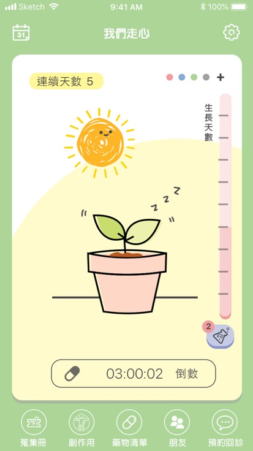

# Medi-Self App Wireframe
Medi-Self is an App that can alert people with heart disease to take medication on time in the long term, combined with a tiny device which clips on each piece of pills packaged in Aluminum Foil can detect the user is taking the pill on time or not. 

UI snapshot 
    

Device model
 
